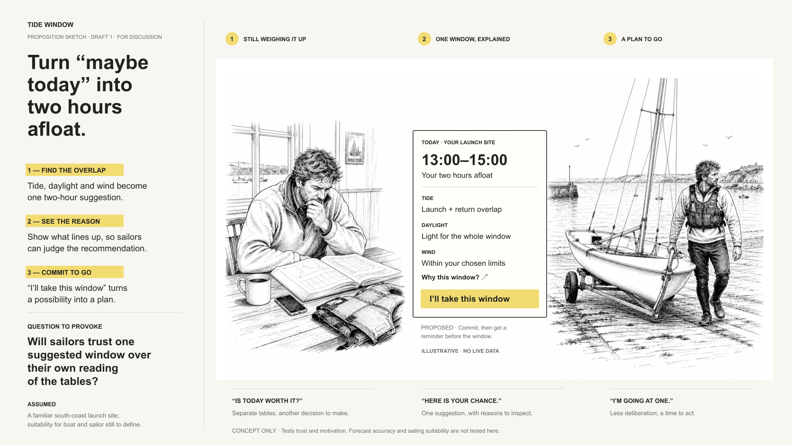

# Rafe Blandford — Agent Skills

Skills I have built and found useful, published so other people's agents can use
them too. Each is a folder containing a `SKILL.md` in the open
[Agent Skills][spec] format.

## Featured: Product Idea Pack

**[`product-idea-pack`](skills/product-idea-pack/)** turns an early
digital-product idea into a proposition sketch, mechanism board, product
storyboard or interactive HTML prototype before anyone commits to polished UI.



It supports three natural starting points: discuss an idea first and invoke the
skill later, provide a structured brief, or ask it to guide a rough thought with
one useful question. Better inputs and purposeful references provide more
control; thin prompts deliberately leave more for the agent to infer.

[Read the standalone guide](skills/product-idea-pack/README.md) ·
[See the examples](examples/product-idea-pack/) ·
[Download the latest release](https://github.com/rafeblandford/skills/releases/latest)

## Other skills

### Working with rafeblandford.com

**[`using-rafeblandford-com`](skills/using-rafeblandford-com/)** — find out what
Rafe Blandford has done, written or can evidence through the site's MCP endpoint,
Content API and machine-readable pages, without scraping the HTML or overstating
what the published selection proves.

### Working with agents and crawlers

**[`verifying-ai-crawlers`](skills/verifying-ai-crawlers/)** — distinguish
verified AI crawler traffic from user-agent claims using published ranges,
signatures and appropriately cautious reporting.

## Installing

### Easiest cross-client route

If you use the community `skills` installer and have Node.js:

```sh
npx skills add rafeblandford/skills
```

Choose the skill you want when prompted.

### Claude Code

```text
/plugin marketplace add rafeblandford/skills
/plugin install product-idea-pack@rafeblandford
```

Use the same pattern for the other catalogue entries. Start a new session or run
`/reload-plugins` after installation.

### Claude Cowork

Download the `.plugin` file from the relevant
[GitHub release](https://github.com/rafeblandford/skills/releases) and upload it
through **Customize → Plugins**.

### Codex

Ask Codex to install the required skill from this repository, for example:

> Install `product-idea-pack` from
> `https://github.com/rafeblandford/skills/tree/main/skills/product-idea-pack`.

Alternatively, copy the complete skill folder into `~/.codex/skills/` and start
a new task.

### Other Agent Skills clients

Copy the complete skill directory using the client's normal Agent Skills
mechanism. Project-local clients commonly discover `.agents/skills/<name>/`.

## Provenance

These skills are created through human–AI collaboration and carry a provenance
field in their frontmatter. For Product Idea Pack, Rafe set the product intent,
format taxonomy, visual system and release decisions; Codex and Claude agents
helped research, draft, generate, test and refine it. Individual examples record
their harness, model and number of human feedback rounds where known.

[Read the provenance vocabulary](https://rafeblandford.com/ai-provenance/).

## Licence and feedback

The public catalogue is Apache-2.0 licensed. Use the skills, change them and make
derivatives under the licence terms.

You do not have to tell me if you use one, but I would be pleased to hear what
you made or changed. Open an [issue](https://github.com/rafeblandford/skills/issues)
or contact me through [rafeblandford.com](https://rafeblandford.com/).

The catalogue is generated from a private development repository, so pull
requests are not accepted. Issues are welcome.

[spec]: https://agentskills.io/specification
