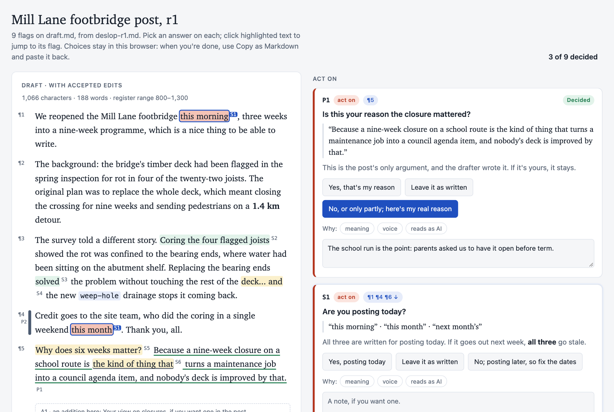
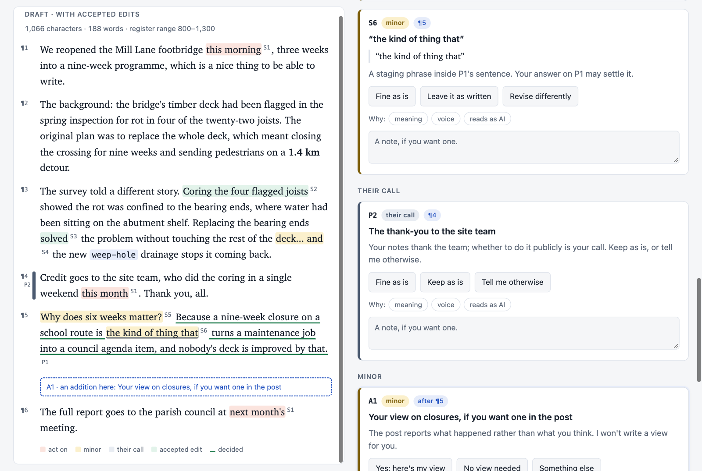

# deslop example: the decision page

[](decision-page.png)

A `deslop` review ends with a **flags block**: the same flags in a form a tool can read, with an exact quote for every place each one touches. `scripts/decision_page.py render` turns the review and its draft into one self-contained page. The draft sits on the left in its own scrolling pane, with the flags beside it.

- **Each flag is highlighted where it sits,** coloured by severity, with its id as a label. Hover or focus a flag and the draft scrolls to it; click the text and its flag comes up. Above, S1 touches three time references, and hovering it lights all three.
- **Accepted wording previews in place.** S2 and S3 are accepted, so the draft shows the new wording in green and the length count updates.
- **Each flag has its own answer labels,** so a question is answered at a glance: "Yes, that's my reason / Leave it as written / No, or only partly; here's my real reason". Your own words are never offered a rewrite, only "Tell me otherwise".
- **"Copy as Markdown"** gives you a decision table to paste back. `decision_page.py record` turns it into a decisions file with counts.

[](decision-page-detail.png)

Some flags sit inside another flag's sentence (S6 inside P1). Some cover a whole paragraph (P2, the bar in the margin). Some mark a place where something could be added (A1, the dashed slot).

## Files

The post, the bearing repair and the parish are invented.

- `draft.md`: the draft. The reviewed text is its `Post (r1)` section.
- `deslop-r1.md`: the review, ending with its flags block.
- `decision-page.html`: the rendered page. Open it in any browser, offline. Your choices stay in that browser.

```sh
python3 deslop/scripts/decision_page.py check  deslop-r1.md
python3 deslop/scripts/decision_page.py render deslop-r1.md -o decision-page.html
```
