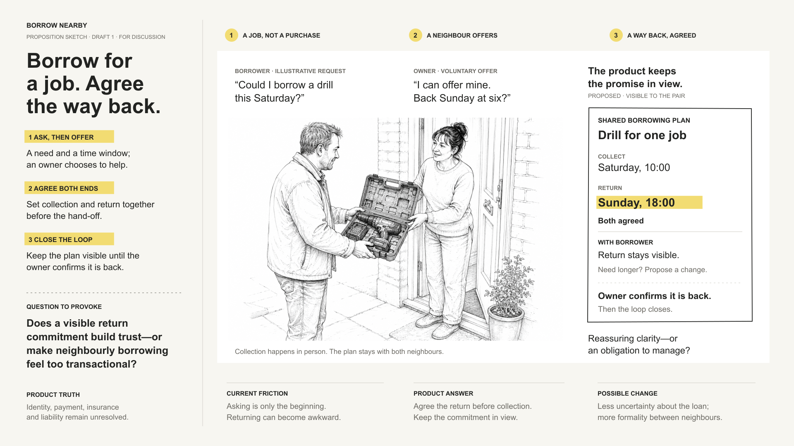
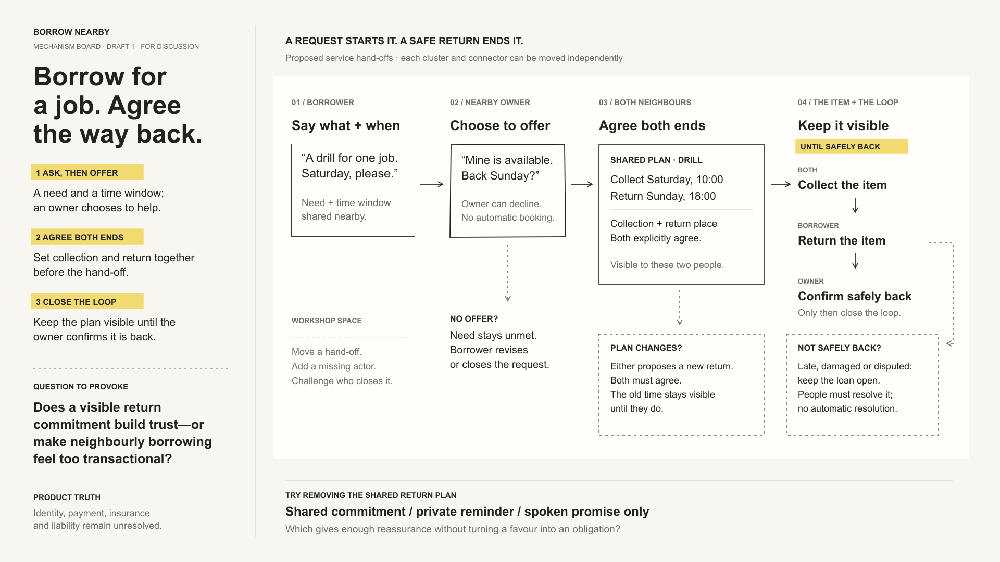

# Product Idea Pack examples

These public-safe examples cover the four formats and different amounts of human
direction. The overview is a replaceable selection of the strongest current
images, not a permanent benchmark. Every value, name and product surface is
illustrative unless the accompanying evaluation says otherwise.

The gallery shows full artefact captures rather than using contact sheets as its
primary evidence. Select any image to open its full-resolution file. Each case
also includes the source prompt and a concise evaluation.

## Tide Window

### Astra proposition sketch

**Proposition sketch · GPT-6 Astra · zero human-feedback rounds.** A weekend
dinghy sailor receives one explained two-hour window where tide, daylight and
wind line up. The supplied prompt resolves the format, audience, intervention
and trust question; the model chooses the composition and performs normal render
QA.

[Read the source prompt](tide-window/astra-prompt.md) ·
[Read the evaluation](tide-window/astra-evaluation.md)

### Cross-format human revision

This is a separate four-format run of the broad Tide Window idea, not a
before-and-after pair with the Astra sketch. One human-feedback round accepted
Draft 1 and requested three bounded corrections: restore a missing box edge,
clip phone content correctly, and stop a future-day storyboard view implying a
current reading.

See the full Draft 2 artefacts

#### Proposition sketch

#### Mechanism board

#### Product storyboard

#### Interactive prototype states

| Today | Tomorrow | Monday |
| --- | --- | --- |
|  |  |  |

[Read the source prompt](tide-window/human-revision/prompt.md) ·
[Read the evaluation](tide-window/human-revision/evaluation.md) ·
[Read the revision decisions](tide-window/human-revision/decisions.md)

This remains supporting revision evidence for v0.1. It is expected to be
replaced by a stronger conversation-led case with two attributable human
revisions.

## Borrow Nearby

**Two-format pack · GPT-6 Astra · zero human-feedback rounds.** A neighbour asks
for an item and time, another chooses whether to offer it, both agree collection
and return, and the product keeps the loop visible until the item is safely
back. Identity, payment, insurance and liability remain explicitly unresolved.

### Proposition sketch

### Mechanism board

The sketch makes the human hand-off tangible; the workshop board exposes the
same proposition as a rearrangeable service loop.

[Read the source prompt](borrow-nearby/prompt.md) ·
[Read the evaluation](borrow-nearby/evaluation.md)

## Return Marker

**Product storyboard · Codex GPT-5 family · zero human-feedback rounds.** A
specific re-entry feature is placed inside a neutral long-form reading surface:
return to the last meaningfully read paragraph, optionally see a compact recap,
then continue. The host remains deliberately incomplete so the feature, rather
than a fictional publisher, can be judged.

[Read the source prompt](return-marker/prompt.md) ·
[Read the evaluation](return-marker/evaluation.md)

## RafeOS Delta Brief

**Interactive HTML prototype · Codex GPT-5 · zero human-feedback rounds.** Later
daily briefings lead with what materially changed while preserving access to
full context. The skill selected the format and the smallest useful three-state
model: establish a baseline, inspect material changes, then recover the complete
current briefing.

### Primary change-led state

See the other full prototype states

#### First briefing

#### Recovered full context

[Read the source prompt](rafeos-delta-brief/prompt.md) ·
[Read the evaluation](rafeos-delta-brief/evaluation.md)

This is the provisional interactive example. A stronger conversation-led RafeOS
case may replace it before the next documentation release.

## Reading the provenance

“Zero human-feedback rounds” means no human changed the artefact between the
saved prompt and Draft 1. It does not mean no human supplied the idea,
constraints or learning question. Autonomous corrections made during rendering
and layout QA remain part of the same one-shot run.

Product Idea Pack itself was created through human–AI collaboration. Its format
taxonomy, visual system and behavioural rules emerged through repeated human
critique of generated outputs, supported by Codex and Claude agents.

## Planned conversation-led example

The next case study begins with a longer exploratory conversation rather than a
prepared brief, then preserves two human-directed revisions. It will test context
reconstruction and revision discipline more directly than the current examples
and is expected to become the lead example for the website and launch article.
