# Product Idea Pack examples

[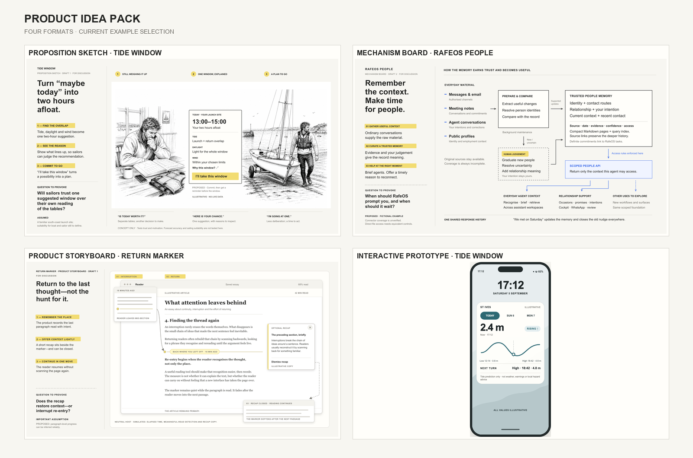](product-idea-pack-overview.png)

These public-safe examples cover the four formats, different idea scales and
different amounts of human direction. The overview selects the strongest
current format examples; it is not a permanent benchmark or a grid of every
retained case. Every value, name and product surface is illustrative unless an
evaluation says otherwise.

The gallery uses full artefact captures rather than contact sheets as its main
evidence. Select an image to open the full-resolution file.

## RafeOS People — lead case study

[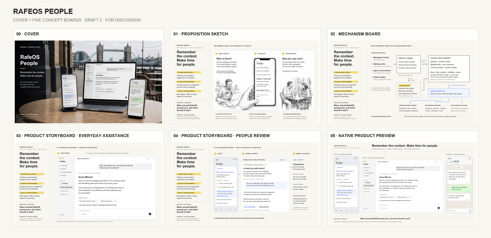](rafeos-people/pack-overview.png)

**Conversation-led full pack · GPT-6 Astra · two human-feedback rounds.** A
shared people memory gives authorised agents useful relationship context and
helps Rafe act on his own intentions without maintaining a conventional
personal CRM.

This example begins with an exploratory conversation rather than a prepared
brief. The skill is invoked only when Rafe says the concept is ready. Three core
formats become five content boards, including two distinct product storyboards;
human feedback then changes the product emphasis, host context and mechanism.
A cover, PDF and actual Figma import show the optional delivery workflow without
pretending the cover is another format.

### Primary feedback target

[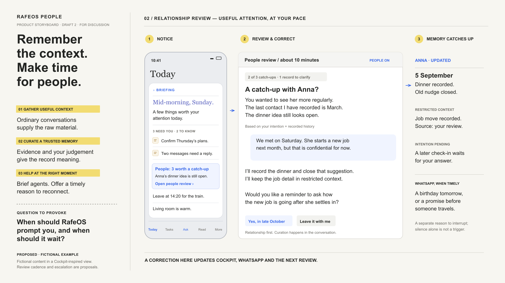](rafeos-people/people-review.png)

[Explore the complete case study](rafeos-people/) ·
[Read the working conversation](rafeos-people/conversation.md) ·
[Read the evaluation](rafeos-people/evaluation.md) ·
[Open the editable Figma file](https://www.figma.com/design/awAeZePD3Xt9ACXPGlVeII) ·
[Download the complete editable pack](https://github.com/rafeblandford/skills/releases/latest/download/rafeos-people-example-pack.zip)

## Tide Window

### Astra proposition sketch

**Proposition sketch · GPT-6 Astra · zero human-feedback rounds.** A weekend
dinghy sailor receives one explained two-hour window where tide, daylight and
wind line up. The supplied prompt resolves the format, audience, intervention
and trust question; the model chooses the composition and performs normal render
QA.

[Read the source prompt](tide-window/astra-prompt.md) ·
[Read the evaluation](tide-window/astra-evaluation.md)

### Cross-format human revision

This is a separate four-format run of the broad Tide Window idea. One
human-feedback round accepted Draft 1 and requested bounded corrections to the
mechanism boundary, phone clipping and future-day semantics.

See the full Draft 2 artefacts

#### Proposition sketch

[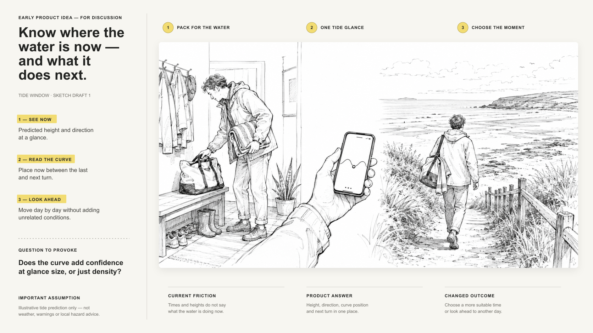](tide-window/human-revision/proposition-sketch.png)

#### Mechanism board

[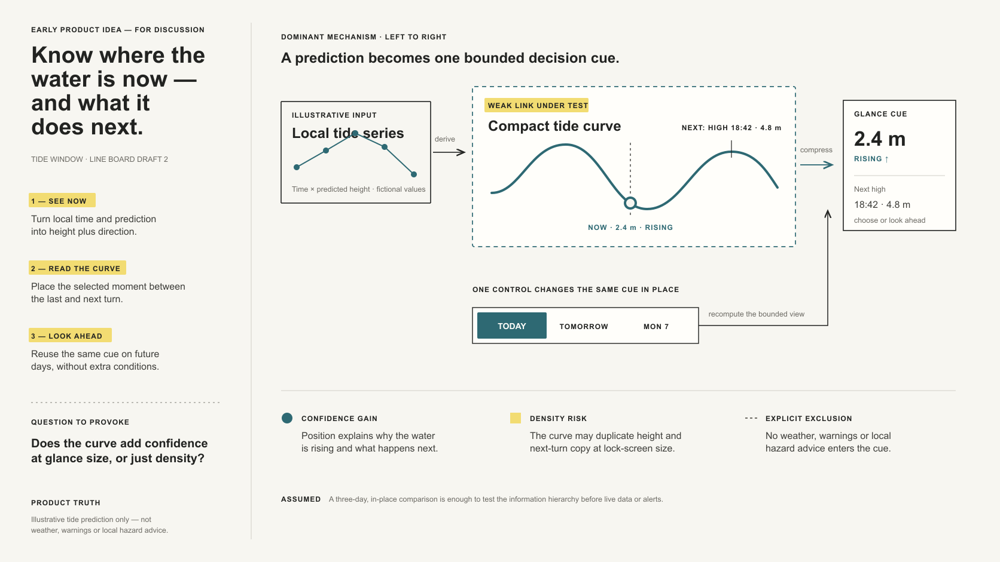](tide-window/human-revision/mechanism-board.png)

#### Product storyboard

[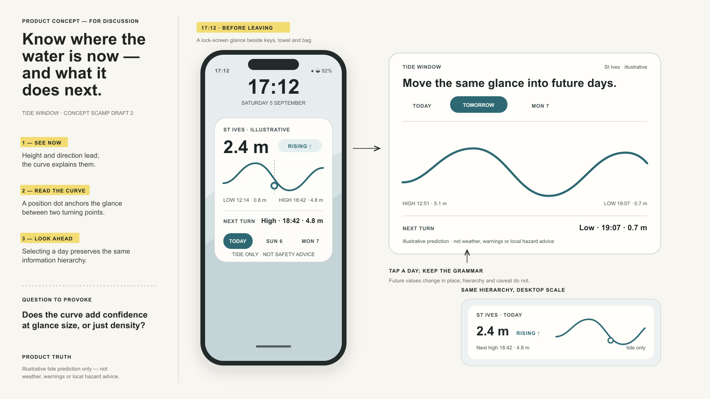](tide-window/human-revision/product-storyboard.png)

#### Interactive prototype states

| Today | Tomorrow | Monday |
| --- | --- | --- |
| [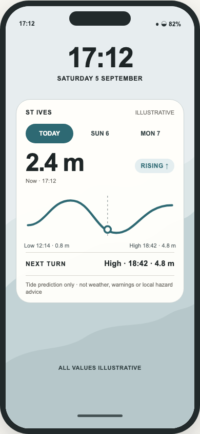](tide-window/human-revision/prototype-today.png) | [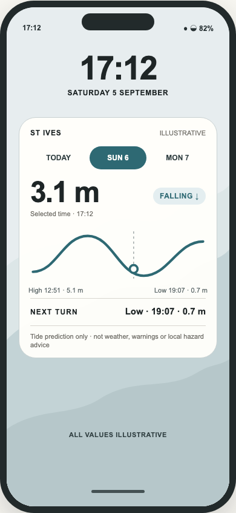](tide-window/human-revision/prototype-tomorrow.png) | [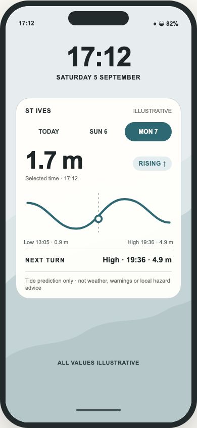](tide-window/human-revision/prototype-monday.png) |

[Read the source prompt](tide-window/human-revision/prompt.md) ·
[Read the evaluation](tide-window/human-revision/evaluation.md) ·
[Read the revision decisions](tide-window/human-revision/decisions.md)

## Return Marker

**Product storyboard · Codex GPT-5 family · zero human-feedback rounds.** A
specific re-entry feature is placed inside a neutral long-form reading surface:
return to the last meaningfully read paragraph, optionally see a compact recap,
then continue. The host remains deliberately incomplete so the feature, rather
than a fictional publisher, can be judged.

[Read the source prompt](return-marker/prompt.md) ·
[Read the evaluation](return-marker/evaluation.md)

## RafeOS Delta Brief

**Interactive HTML prototype · Codex GPT-5 · zero human-feedback rounds.** Later
daily briefings lead with what materially changed while preserving access to
full context. The skill selected the format and the smallest useful three-state
model from a deliberately thin brief.

### Primary change-led state

[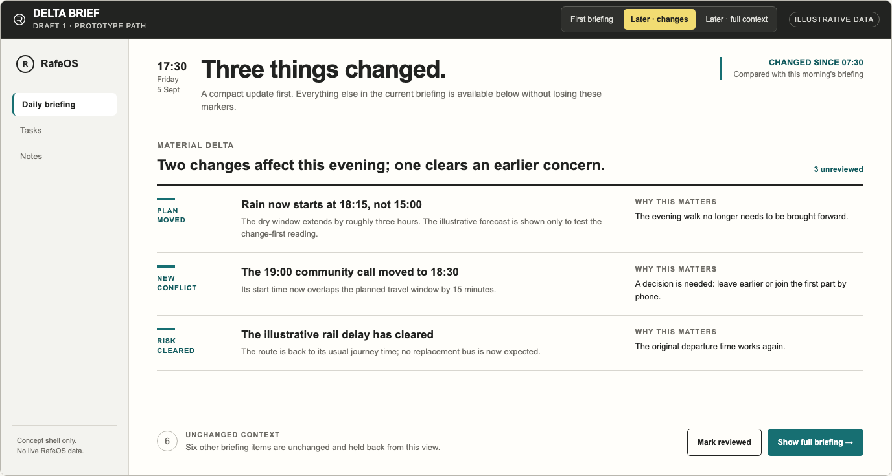](rafeos-delta-brief/later-changes.png)

See the other full prototype states

#### First briefing

[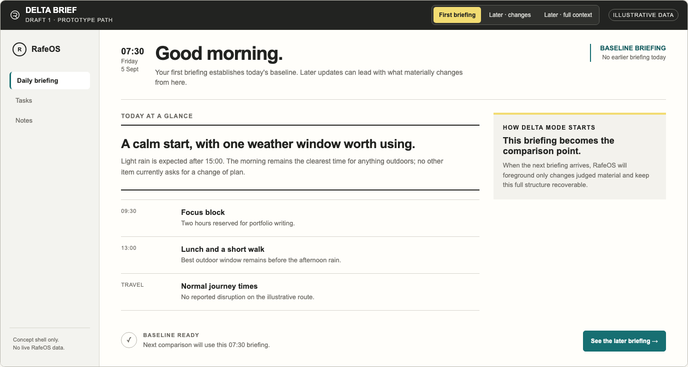](rafeos-delta-brief/first-briefing.png)

#### Recovered full context

[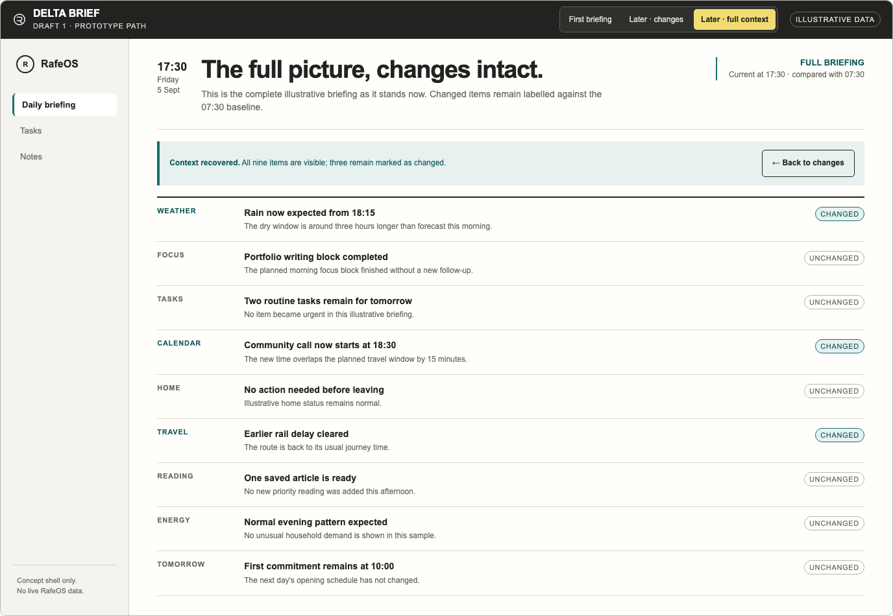](rafeos-delta-brief/later-full-context.png)

[Read the source prompt](rafeos-delta-brief/prompt.md) ·
[Read the evaluation](rafeos-delta-brief/evaluation.md)

## Time and human judgement

Across the release tests, a typical generation or revision turn took roughly
15–20 minutes. RafeOS People took about one hour of recorded agent runtime
across three main production turns, plus its preceding discussion and human
pauses. These are observations, not performance guarantees or controlled
benchmarks.

The value is reaching a concrete, discussable artefact quickly—not outsourcing
the decision. Inspect each output, challenge what it assumes and refine its
language, density and framing for the people who will see it. Rafe estimates a
comparable multi-board pack could take a working day or longer to create
manually, but the generated pack still requires judgement and may require
revision.

## Reading the provenance

“Zero human-feedback rounds” means no human changed the artefact between the
saved prompt and Draft 1. It does not mean no human supplied the idea,
constraints or learning question. Autonomous corrections made during rendering
and layout QA remain part of the same one-shot run.

Product Idea Pack itself was created through human–AI collaboration. Its format
taxonomy, visual system and behavioural rules emerged through repeated human
critique of generated outputs, supported by Codex and Claude agents.
