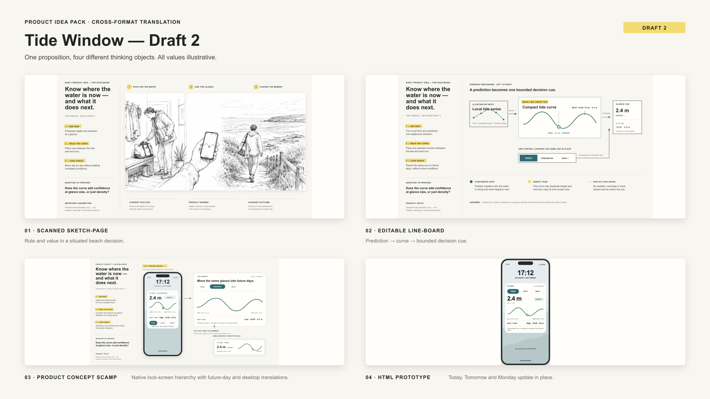
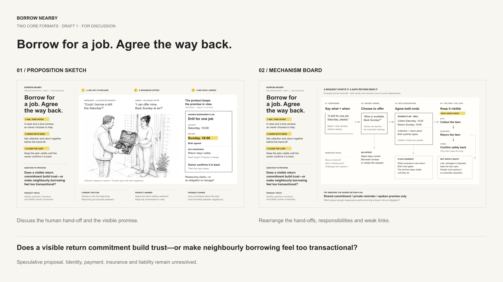
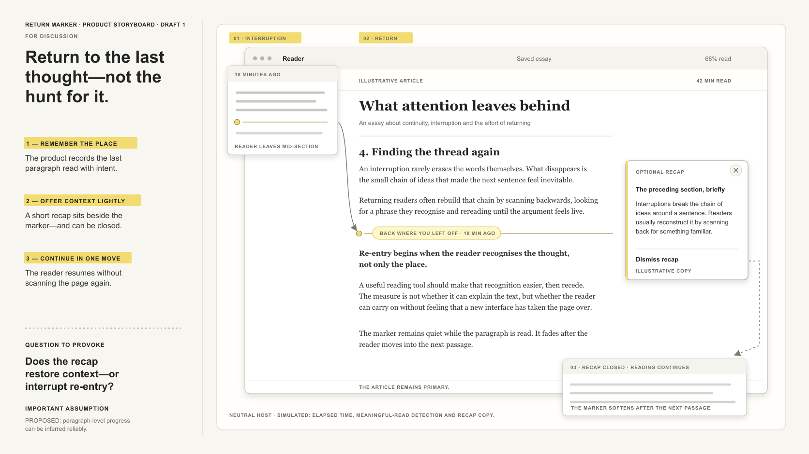
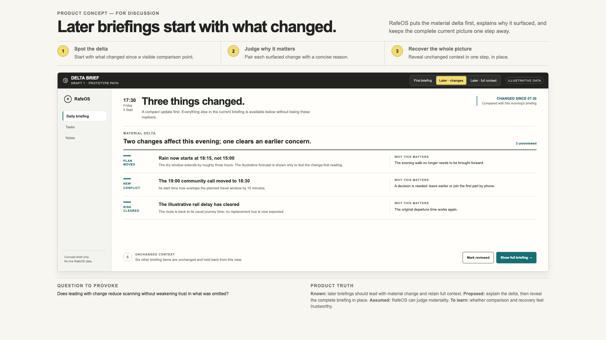

# Product Idea Pack examples

These are public-safe examples selected from the release test programme. They
show distinct formats and different amounts of human direction. Every value,
name and product surface is illustrative unless the note says otherwise.

## Tide Window

**Proposition sketch · GPT-6 Astra · zero human feedback rounds.** A weekend
dinghy sailor receives one explained two-hour window where tide, daylight and
wind line up. The prompt specified the audience, intervention, trust question
and safety boundary. The model chose the three-beat composition and performed
its own render QA. Source revision: `8ef77b2`.

**Separate four-format run · Codex · one human feedback round.** The same broad
idea is translated into a proposition sketch, mechanism board, product
storyboard and HTML prototype. A human then requested three bounded Draft 2
corrections: restore a missing box edge, clip phone content correctly, and stop
a future-day view implying a current reading. Source revision: `007ade1`.

This pair shows two different things: the likely one-shot starting quality and
the value of a precise human correction. It is not a before-and-after pair from
the same run.

## Borrow Nearby

**Two-format pack · GPT-6 Astra · zero human feedback rounds.** A neighbour asks
for an item and time, another chooses whether to offer it, both agree collection
and return, and the product keeps the loop visible until the item is safely
back. The same proposition is expressed as a contextual sketch and a workshop
mechanism board. Identity, payment, insurance and liability are explicitly
unresolved. Source revision: `d2fab94`.

## Return Marker

**Product storyboard · Codex GPT-5 family · zero human feedback rounds.** A
specific re-entry feature is placed inside a neutral long-form reading surface:
return to the last meaningfully read paragraph, optionally see a compact recap,
then continue. The host remains deliberately incomplete so the feature, rather
than a fictional publisher, can be judged. Source revision: `d2046bc`.

## RafeOS Delta Brief

**Interactive HTML prototype · Codex GPT-5 · zero human feedback rounds.**
The brief said that later daily briefings should lead with what materially
changed while preserving access to full context. It did not specify a format or
state count. The skill selected a three-state prototype, then exercised the
first-briefing, change-led and recovered-full-context states. Source revision:
`007ade1`.

## Reading the provenance

“Zero human feedback rounds” means no human changed the artefact between the
saved prompt and Draft 1. It does not mean no human supplied the idea, constraints
or desired learning question. Autonomous corrections made during rendering and
layout QA remain part of the same one-shot run.

The Product Idea Pack itself was created through human–AI collaboration. Its
format taxonomy, visual system and behavioural rules emerged through repeated
human critique of generated outputs, supported by Codex and Claude agents.

## Planned conversation-led example

A future case study will begin with a longer exploratory conversation rather
than a prepared brief, then preserve two human-directed revisions. That will
test context reconstruction and revision discipline more directly than the
release examples above, and is expected to become the lead example for the
website and launch article.
