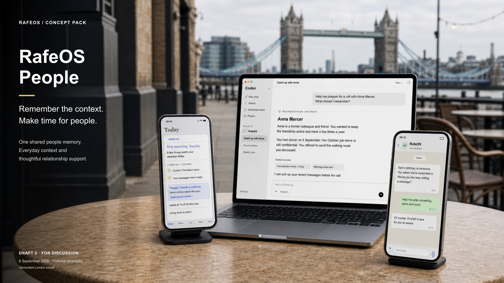
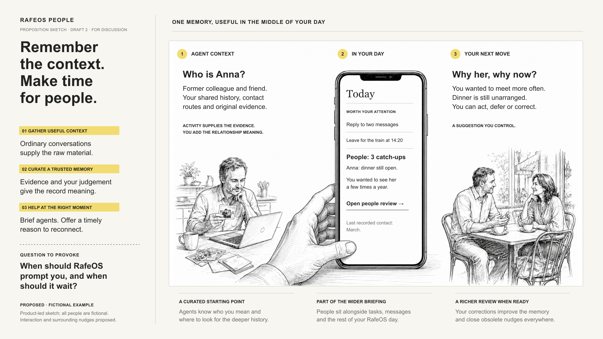
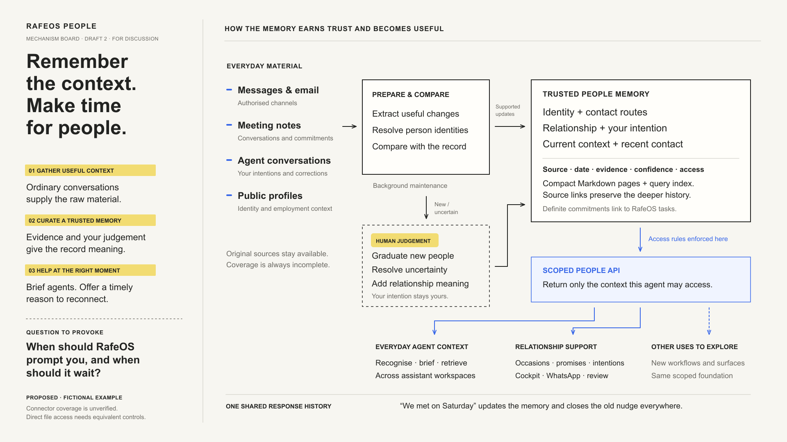
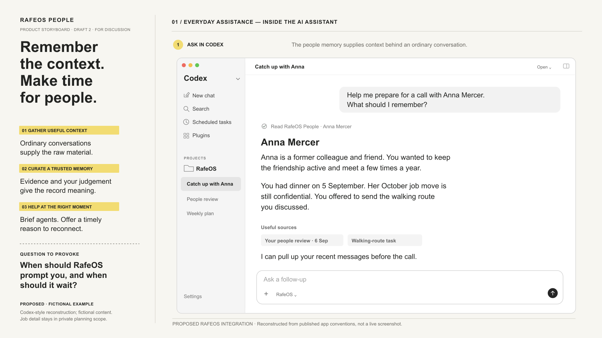
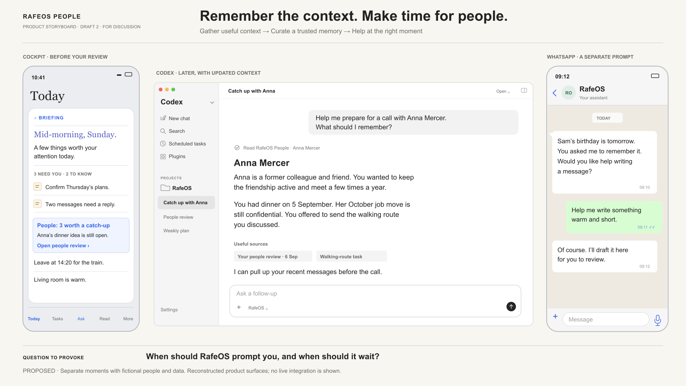
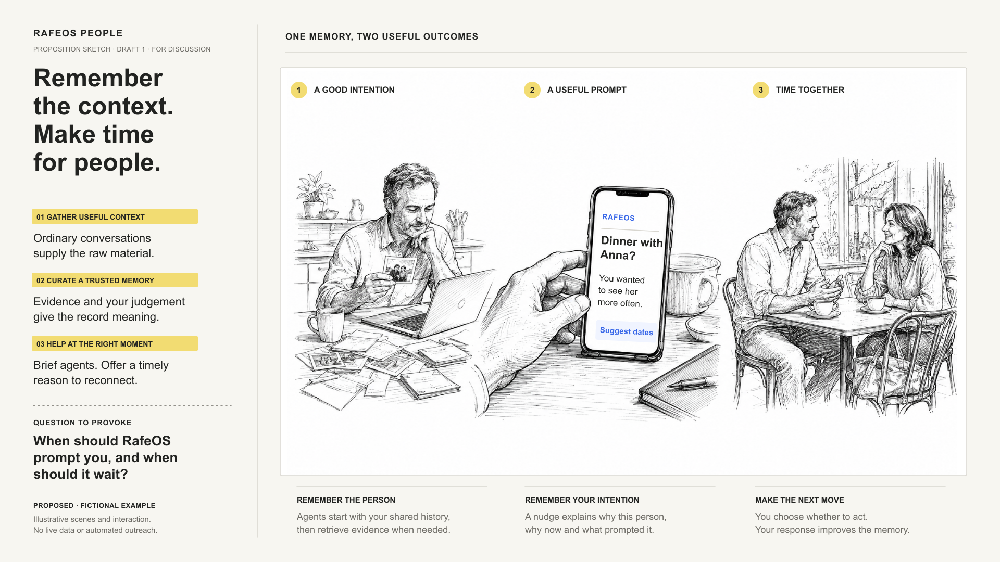
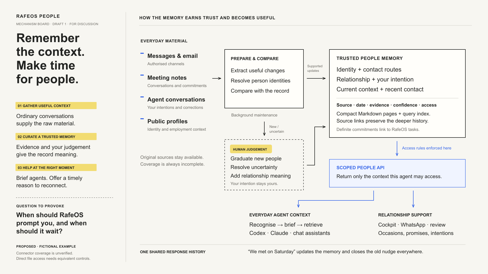
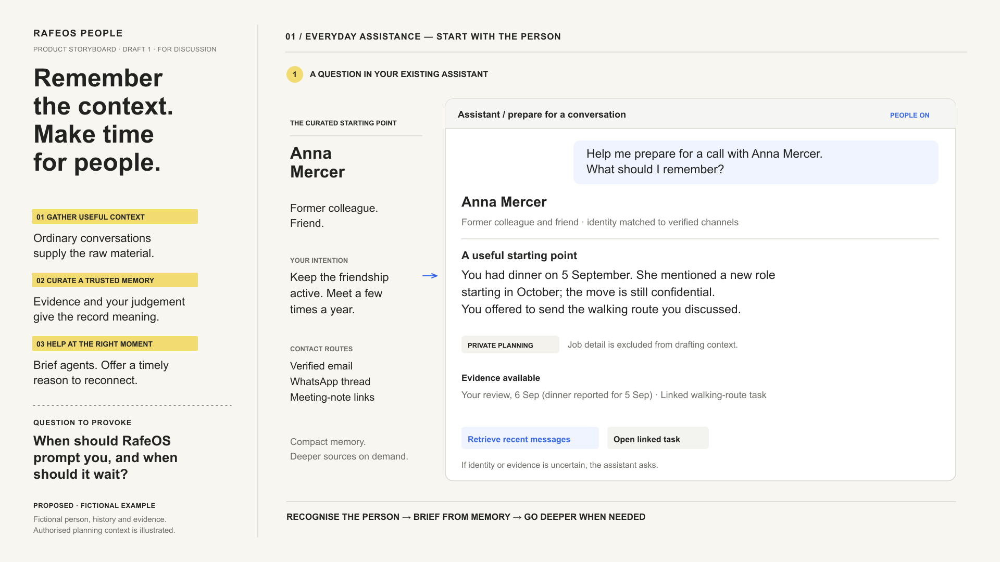
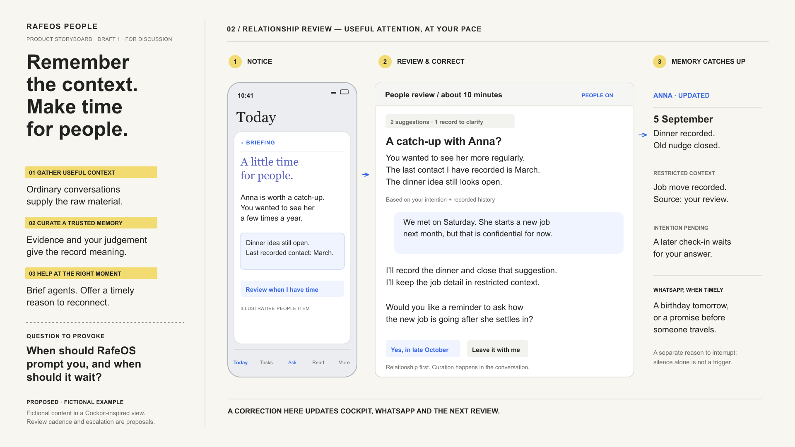
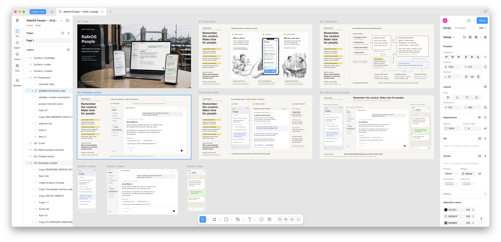

# RafeOS People

**Conversation-led full pack · GPT-6 Astra · two human-feedback rounds.** A
shared people memory gives authorised agents useful relationship context and
helps Rafe act on his own intentions without maintaining a conventional
personal CRM.

The example began with an exploratory conversation, not a prepared brief. It
then moved through Draft 1, a substantial human-directed revision, a final
native-product addition and an optional PDF/Figma hand-off.

## The complete six-page set

The cover packages the work; the five boards are the concept artefacts.

### Cover

### Proposition sketch

### Mechanism board

### Product storyboard — Everyday assistance

### Product storyboard — People review

This is the primary behavioural feedback target. One human correction updates
the recorded contact, closes an obsolete dinner nudge, preserves confidential
context and leaves a later check-in pending until Rafe answers.

### Native-product preview

## From conversation to revision

Read the [edited working conversation](conversation.md) to see how the idea was
defined before the skill was invoked, and how later human feedback changed the
artefacts. The [starting point](input.md), [structured brief](brief.yaml) and
[accepted decisions](decisions.md) provide the corresponding durable records.

Compare the four original Draft 1 boards

### Draft 1 proposition sketch

### Draft 1 mechanism board

### Draft 1 product storyboard — Everyday assistance

### Draft 1 product storyboard — People review

## Continue in Figma

The actual destination contains the six principal boards and three standalone
product surfaces. The screenshot deliberately retains Figma's layers,
selection and properties panels to demonstrate that this is an editable
hand-off rather than another flattened contact sheet.

[Open the editable Figma file](https://www.figma.com/design/awAeZePD3Xt9ACXPGlVeII)

The full downloadable example pack—including PDF, editable SVGs, assets,
prompts, reference PNGs and import notes—is supplied as a GitHub release asset
rather than duplicated in the repository.

[Download the complete editable example pack](https://github.com/rafeblandford/skills/releases/latest/download/rafeos-people-example-pack.zip)

## Time and judgement

The three main production turns in this example took approximately 17, 20 and
22 minutes. The preceding product discussion and human pauses sit outside that
agent-runtime total. Read the [evaluation](evaluation.md) for context and the
limits of the comparison.

The speed is useful because it makes an idea concrete while it is still cheap
to change. The boards should be inspected and used as stimulus: a human still
decides whether the concept is worthwhile, whether its claims are honest and
whether its language and visual density suit the intended audience.
