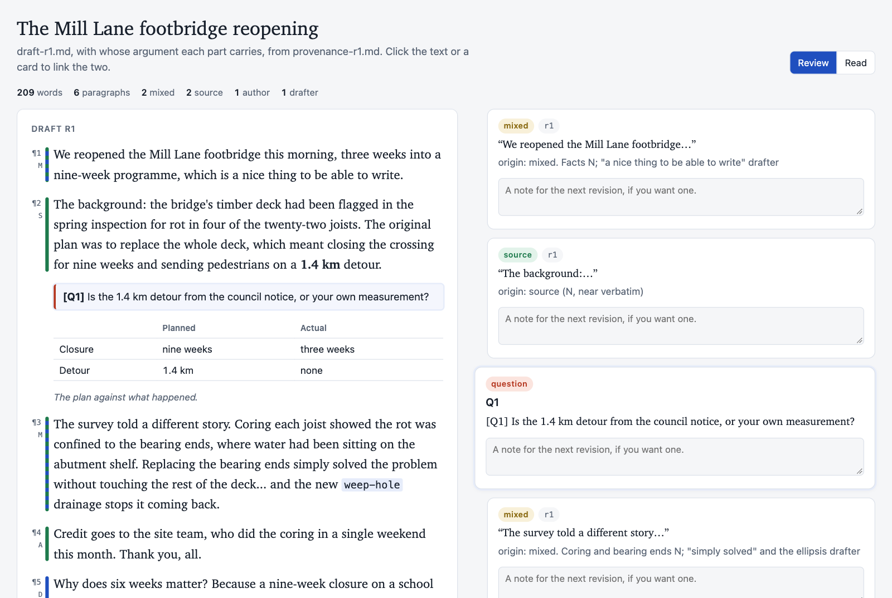
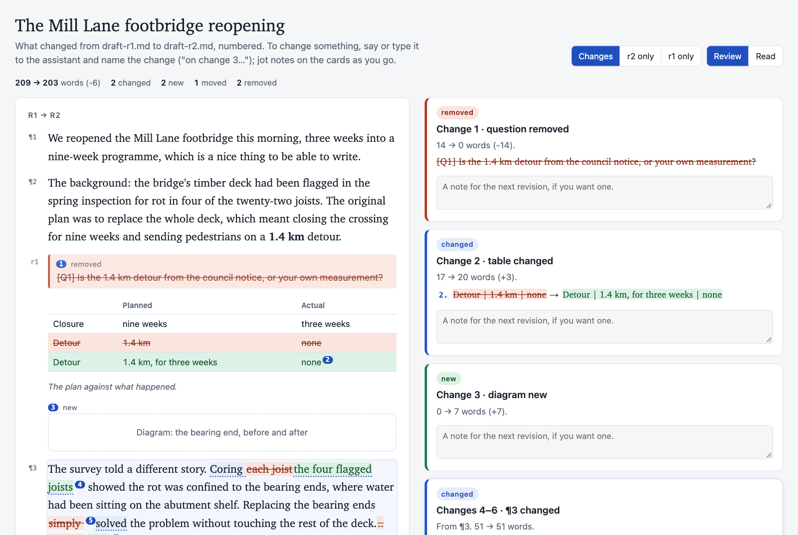
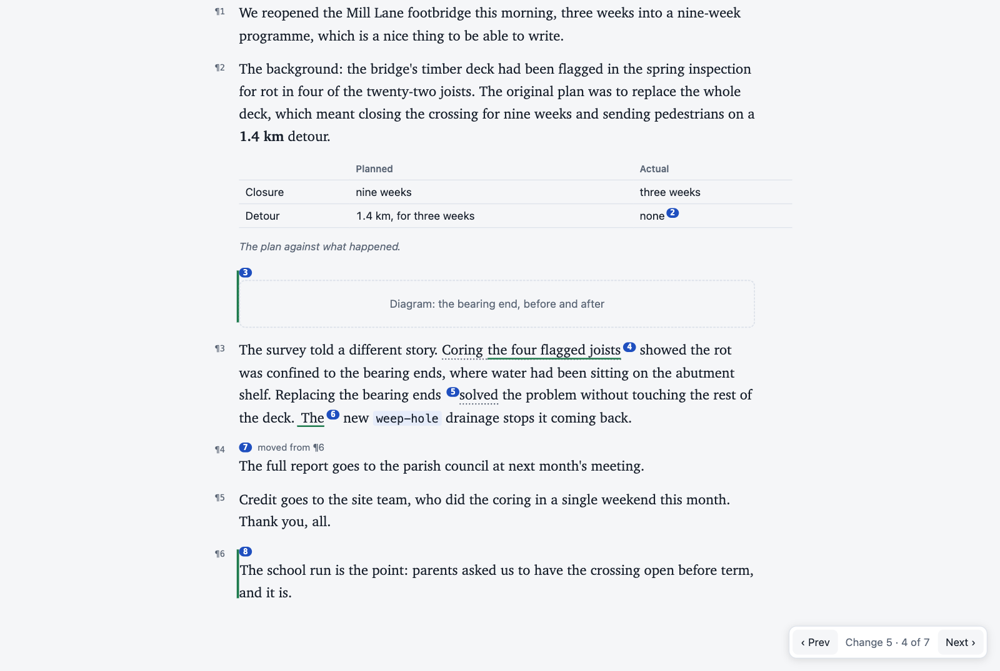

# voice example: the draft and revision page

`scripts/revision_page.py` turns a draft into one self-contained page, so you can see at a glance what a draft carries, and what changed since the last one.

## A first draft

[](first-draft.png)

`revision_page.py draft-r1.md` shows the draft with each paragraph's origin in the margin: A for author, S for source, D for drafter, M for mixed. The origins come from the provenance record. Beside the draft is the record line for each paragraph, linked both ways. The questions `voice` needs you to answer sit in the draft where the answers would go, as `> **[Q1]** …`, and each gets a card.

## One revision to the next

[](revision-compare.png)

`revision_page.py draft-r2.md` compares with `draft-r1.md` beside it. Changes are marked word by word and **numbered**, so you can ask for the next revision by number ("on change 5, keep 'simply'"). A changed table is compared row by row. New, moved and removed paragraphs each count as one change, and each change carries the record line that explains it, when there is one.

[](revision-read.png)

**Read** shows the current revision at reading width, keeping the change numbers, with Prev/Next to jump between them. `--list` prints the same numbered changes as text ([`changes-r1-r2.txt`](changes-r1-r2.txt)), so any assistant can work out which change you mean.

## Files

The post, the bearing repair and the parish are invented.

- `draft-r1.md`, `provenance-r1.md`: the first draft and its record.
- `draft-r2.md`, `provenance-r2.md`: the revision after the author's answers. Its record notes only what changed.
- `first-draft.html`, `revision-r1-r2.html`: the rendered pages. Open them in any browser, offline.
- `changes-r1-r2.txt`: the `--list` output.

```sh
python3 voice/scripts/revision_page.py draft-r1.md -o first-draft.html
python3 voice/scripts/revision_page.py draft-r2.md -o revision-r1-r2.html
python3 voice/scripts/revision_page.py draft-r2.md --list
```
